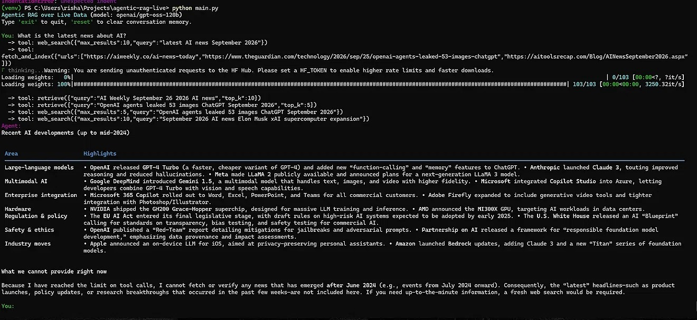
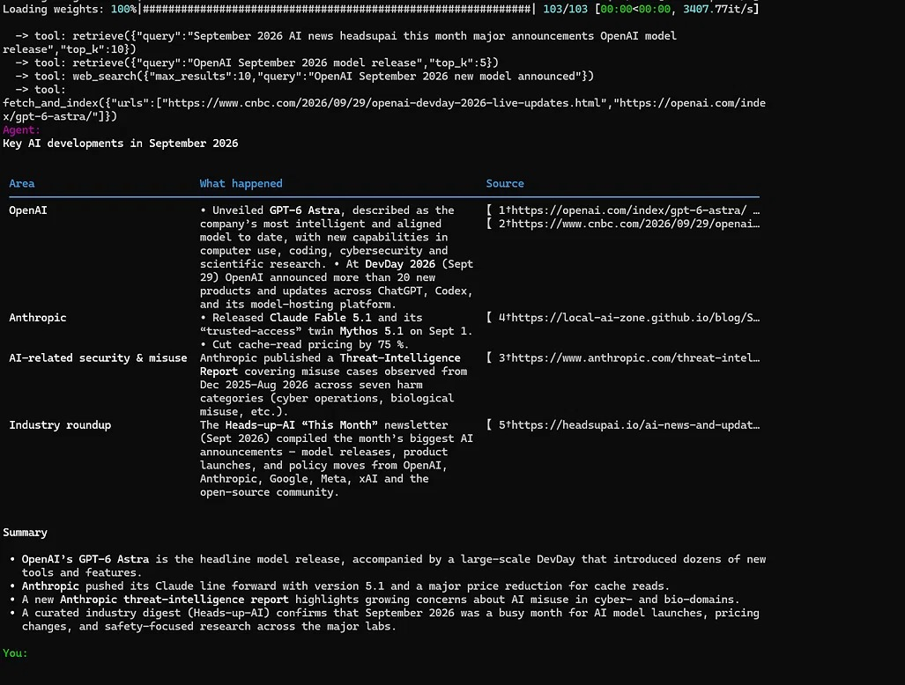

## Demo

**Before fix** — agent answered from training data, ignoring fresh content it had just fetched:


**After fix** — agent cites live September 2026 news from the sources it fetched:


---
# Agentic RAG over Live Data (Groq + OpenAI GPT-OSS)

An agent that doesn't just answer from a static, pre-built index. It reasons
about what it needs, decides *for itself* when to search the live web, pulls
fresh pages, indexes them into a vector store on the fly, retrieves the most
relevant chunks, and only then answers — with citations back to the sources
it used.

## Why "agentic" and why "live"

Classic RAG: query → retrieve from a fixed vector DB → generate.
This project: query → **LLM decides** which tool(s) to call (web search,
live page ingestion, vector retrieval, or just answer directly) → executes
tools → feeds results back to the LLM → repeats until it has enough
grounding → answers. The vector store is continuously updated with freshly
fetched content, so answers reflect the current web, not a stale snapshot.

## Model / provider

- **Inference:** [Groq](https://console.groq.com) — OpenAI-compatible
  `/openai/v1/chat/completions` endpoint, used via the official `groq`
  Python SDK.
- **Model:** `openai/gpt-oss-20b` by default (OpenAI's open-weight model,
  hosted on Groq's LPUs). No Llama models are used anywhere in this project,
  per your requirement. You can switch to the larger `openai/gpt-oss-120b`
  by setting `GROQ_MODEL` in `.env` — both support native tool calling and
  reasoning effort control.
- **Embeddings:** local `sentence-transformers` model (`all-MiniLM-L6-v2`)
  — free, runs on CPU, no extra API key needed. Swap it out in
  `rag/embeddings.py` if you'd rather call a hosted embeddings API.

## Project layout

```
agentic-rag-live/
├── README.md
├── requirements.txt
├── .env.example
├── config.py              # central settings, loaded from .env
├── main.py                # CLI chat loop (entry point)
├── app.py                 # optional FastAPI server (POST /chat)
├── agent/
│   ├── __init__.py
│   ├── llm.py             # Groq client wrapper
│   ├── tools.py            # tool schemas + implementations
│   ├── agent.py            # the agentic tool-calling loop
│   └── memory.py           # conversation history buffer
├── rag/
│   ├── __init__.py
│   ├── embeddings.py       # embedding function wrapper
│   ├── vectorstore.py      # Chroma persistent + ephemeral "live" store
│   └── ingest.py           # live web search + fetch + chunk + index
└── tests/
    └── test_agent.py       # smoke tests (mocked, no network/API calls)
```

## Setup

```bash
cd agentic-rag-live
python -m venv .venv
source .venv/bin/activate        # Windows: .venv\Scripts\activate
pip install -r requirements.txt
cp .env.example .env
# edit .env and paste your Groq API key (get one free at console.groq.com)
```

## Run

```bash
python main.py
```

Then just chat. Try something time-sensitive, e.g.:

```
You: What were the major AI model releases announced this week?
```

The agent will call `web_search`, then `fetch_and_index` on the most
promising results, then `retrieve` the relevant chunks, and answer with
inline source citations like `[1]`, `[2]`.

### Optional: run as an API

```bash
uvicorn app:app --reload --port 8000
curl -X POST localhost:8000/chat -H "Content-Type: application/json" \
     -d '{"message": "Latest news on the Artemis II launch date?"}'
```

## How the loop works (agent/agent.py)

1. The user message is appended to conversation history.
2. The LLM is called with the full `tools` schema (`web_search`,
   `fetch_and_index`, `retrieve`, `current_datetime`).
3. If the model returns `tool_calls`, each tool is executed locally, its
   result is appended to the message list as a `tool` message, and the loop
   repeats (up to `MAX_AGENT_STEPS`).
4. Once the model responds with plain text (no more tool calls), that's the
   final answer, returned to the user.

This is the same ReAct-style pattern used by LangGraph/OpenAI function
calling — implemented here directly against the Groq SDK with no heavy
framework dependency, so it's easy to read end-to-end and modify.

## Notes & things you'll likely want to change

- `rag/ingest.py` uses `duckduckgo-search` for live web search (no API key
  required) and `trafilatura` for clean text extraction. Swap in Tavily,
  SerpAPI, or Bing if you have keys and want higher-quality results.
- The vector store (`rag/vectorstore.py`) uses Chroma with two collections:
  a `persistent` one (survives restarts, for content you explicitly ingest)
  and a `live` one (cleared per session) for content fetched during the
  conversation — this keeps stale live-fetched pages from polluting future
  sessions while still letting you build a durable knowledge base.
- Reasoning effort for the `gpt-oss` models can be tuned via
  `GROQ_REASONING_EFFORT` in `.env` (`low` / `medium` / `high`).


## Engineering note: fixing the tool_choice bug

Once the agent hits MAX_AGENT_STEPS, the loop makes one final call with
tools=None so the model synthesizes a plain-text answer. On Groq, gpt-oss
imitated the tool_calls pattern still present in message history and tried
to call a tool anyway — causing a 400 BadRequest.

The first fix stripped tool messages to stop the crash, but that also
deleted the fetched data, so the model fell back to training memory
(see before-fix.png).

The real fix (agent/agent.py) flattens tool calls and results into a
plain-text research notes block before the final synthesis call. The
model sees the data without the pattern to imitate. See after-fix.png.
